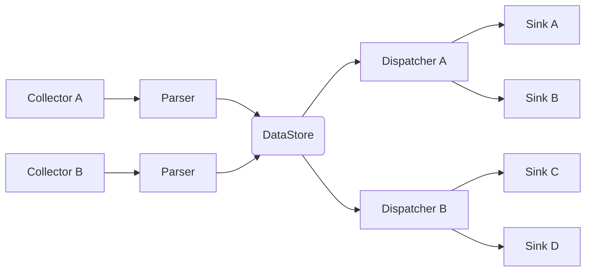

# data-collector

This is a program used to gather data from various sources (like MQTT topics)
and push the data to different sinks (e.g. to file, Gotify notification service,
IOTPlotter, database). Dynamically configurable and intended to be deployed as
a containerized service.

## Overview

Overall architecture:

Legend:

1. Collectors - collects data from configured sources
    - MQTT - subscribes to configured topics and gathers the data
    - File - gathers the data from files
2. Parsers - convert data from source format into the intermediate value to be
   used by dispatcher/sink
    - jsonpath - uses jsonpath to parse data
    - regex - uses regular expression to parse data
3. DataStore - main data structure, where data is held between publishing by
   collector and sending by dispatcher/sink
4. Dispatchers - schedules which chunk of data will be dispatched
    - cron: uses cron-like interface to schedule when which data should be dispatched
    - event: event triggered (e.g. on value changed, on threshold)
5. Sinks - dispatches the scheduled data to the sink
    - REST-based sinks - for sinks using REST interface (e.g. gotify)
    - file sink - for sinks using file interface (e.g. csv file writer)

## Example configuration

Configuration is in YAML file. Example is [here](./configs/example.yaml)

## Deployment

This project uses `ko` as a build system.

## Todo list

1. Collectors:
    - [x] mqtt
    - [x] file
2. Parsers:
    - [ ] add expression eval support
    - [x] jsonpath
    - [ ] regex
3. Dispatchers:
    - [x] cron
    - [ ] event
4. Sinks:
    - [x] support for templating output
    - [ ] generic REST (template/json)
    - [ ] gotify (template)
    - [ ] iotplotter (json)
    - [ ] file (csv)
    - [x] stdout (for debugging or template)
5. Configuration:
    - [x] yaml support
    - [x] replacing env variables
        - [ ] testing needed
6. Others:
    - [ ] CI

## Dependencies

- [jsonpath](https://github.com/PaesslerAG/jsonpath)
- [Paho MQTT](https://github.com/eclipse/paho.mqtt.golang)
- [gocron](https://github.com/go-co-op/gocron)
- [go-yaml](https://github.com/goccy/go-yaml)
