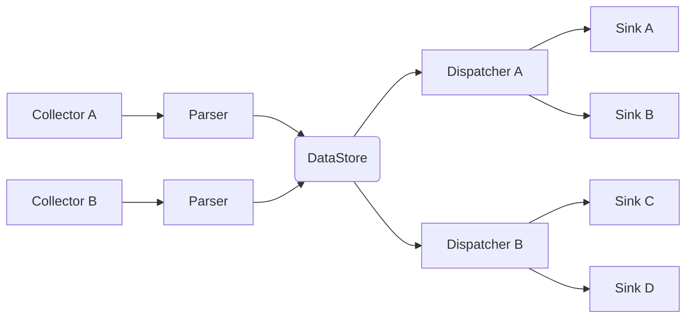

# data-collector

[](https://img.shields.io/badge/License-MIT-brightgreen.svg)
[](https://goreportcard.com/report/gitlab.com/mek_x/data-collector)
[](https://gitlab.com/mek_x/data-collector/-/commits/main)
[](https://gitlab.com/mek_x/data-collector/-/graphs/main/charts)

This is a program used to gather data from various sources (like MQTT topics) and push the data to different sinks (e.g.
to file, Gotify notification service, IOTPlotter). Dynamically configurable and intended to be deployed as a
containerized service.

## Overview

Overall architecture:



Legend:

1. Collectors - collects data from configured sources
    - MQTT - subscribes to configured topics and gathers the data
    - File - gathers the data from files
    - Shell - gets data from shell
2. Parsers - convert data from source format into the intermediate value to be used by dispatcher/sink
    - jsonpath - uses jsonpath to parse data
    - regex - uses regular expression to parse data
3. DataStore - main data structure, where data is held between publishing by collector and sending by dispatcher/sink
4. Dispatchers - schedules which chunk of data will be dispatched
    - cron: uses cron-like interface to schedule when which data should be dispatched
    - event: event triggered (e.g. on value changed, on threshold)
5. Sinks - dispatches the scheduled data to the sink
    - REST-based sinks - for sinks using REST interface (e.g. gotify)
    - file sink - for sinks using file interface (e.g. csv file writer)

## Example configuration

Configuration is in YAML file. Example is [here](./configs/example.yaml)

### Environment variable substitution

Using the `%%ENV_VARIABLE%%` notation it's possible to substitute this entries with environment variables, which may be
useful to use same config in different environments, but with some things that are different (e.g. `HOSTNAME`, some kind
of secrets).

### Support for evaluating expressions

Used in:

- `data.<name>.conv` - to convert variable, e.g. multiply the value by 10 (`val * 10`)
- `dispatchers.sink[].spec` - when `type` is `expr` it can be used for templating, e.g. to generate json (`toJSON(val)`)

Syntax for the evaluation is documented here: [Expr Language Definition](https://expr.medv.io/docs/Language-Definition)

## Deployment

This project uses `ko` as a build system. See the current defaults in the [config file](.ko.yaml).

### Docker containers

By default containers for 32/64 bit arm and 64 x86 architectures are being built. Example deployment using
`docker-compose.yml` may be like in this example:

```yaml
version: '2'

volumes:
  config:

services:
  data-collector:
    image: registry.gitlab.com/mek_x/data-collector:latest
    command:
    - /config/config.yaml
    volumes:
    - config:/config
    restart: always
```

Configuration file (`config.yaml`) needs to be manually copied to the `config` volume in this case. `command` is giving
an argument to the `data-collector` application, where to look for it.

## Development

### Adding new modules

Adding additional collectors, parsers, dispatchers and sinks is pretty much self-contained. Only necessary things is to
add the module code itself and import it in `internal/modules/modules.go`. Take a look at the other modules as an
example, like [file collector](pkg/collector/file/file.go).

## Dependencies

- [jsonpath](https://github.com/PaesslerAG/jsonpath)
- [Paho MQTT](https://github.com/eclipse/paho.mqtt.golang)
- [gocron](https://github.com/go-co-op/gocron)
- [go-yaml](https://github.com/goccy/go-yaml)
- [expr](https://github.com/antonmedv/expr)
- [mapstructure](https://github.com/mitchellh/mapstructure)
